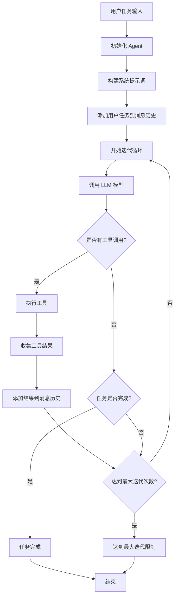

# Agent 工作流程详解

## 概述

Mini SWE Agent 的核心工作流程是一个基于工具调用的迭代执行循环，旨在通过 AI 模型和工具的协作来完成软件工程任务。

## 核心架构



## 详细工作流程

### 1. 初始化阶段

```typescript
// 系统提示词设置
const systemPrompt = `
You are a software engineering AI agent. Your task is to solve the given problem by:
1. Understanding the requirements
2. Writing code to implement the solution
3. Testing your implementation
4. Making corrections if needed

You have access to the following tools:
- bash: Execute shell commands
- editor: Read, write, and edit files

Work step by step and think carefully about each action.
`;
```

**关键组件初始化：**
- 模型连接 (OpenAI/LiteLLM)
- 环境配置 (工作目录)
- 工具注册 (bash, editor)
- 消息历史初始化

### 2. 消息管理

```typescript
interface Message {
  role: 'system' | 'user' | 'assistant';
  content: string;
}

// 消息历史结构
messages: [
  { role: 'system', content: systemPrompt },
  { role: 'user', content: userTask },
  // ... 后续对话历史
]
```

### 3. 核心执行循环

#### 3.1 模型调用
```typescript
const response = await model.complete(messages, tools);
```

**输入：**
- 完整消息历史
- 可用工具列表

**输出：**
- 文本响应
- 工具调用请求（可选）

#### 3.2 工具执行逻辑

```typescript
if (response.toolCalls && response.toolCalls.length > 0) {
  for (const toolCall of response.toolCalls) {
    const tool = tools.find(t => t.name === toolCall.name);
    const result = await tool.execute(toolCall.arguments);
    
    // 将结果添加到消息历史
    messages.push({
      role: 'user',
      content: `Tool ${toolCall.name} result:\n${result}`
    });
  }
}
```

#### 3.3 完成检测

```typescript
// 简单的完成检测逻辑
if (response.content.toLowerCase().includes('task complete') || 
    response.content.toLowerCase().includes('done')) {
  break; // 退出循环
}
```

### 4. 工具系统详解

#### 4.1 Bash 工具

```typescript
{
  name: 'bash',
  description: 'Execute a bash command in the environment',
  schema: {
    type: 'object',
    properties: {
      command: { type: 'string', description: 'The bash command to execute' }
    },
    required: ['command']
  },
  execute: async (args) => {
    const result = await environment.execute(args.command);
    return formatCommandResult(result);
  }
}
```

**支持操作：**
- 文件系统操作 (ls, mkdir, rm)
- 代码编译和运行
- 包管理 (npm, pip)
- Git 操作
- 系统命令

#### 4.2 Editor 工具

```typescript
{
  name: 'editor',
  description: 'Read, write, and edit files',
  schema: {
    type: 'object',
    properties: {
      command: { enum: ['view', 'create', 'str_replace'] },
      path: { type: 'string' },
      content: { type: 'string' },
      old_str: { type: 'string' },
      new_str: { type: 'string' }
    }
  }
}
```

**支持操作：**
- `view`: 查看文件内容（带行号）
- `create`: 创建新文件
- `str_replace`: 字符串替换编辑

### 5. 错误处理机制

#### 5.1 工具执行错误
```typescript
try {
  const result = await tool.execute(toolCall.arguments);
  // 成功处理
} catch (error) {
  const errorMessage = error instanceof Error ? error.message : String(error);
  messages.push({
    role: 'user',
    content: `Tool ${toolCall.name} error: ${errorMessage}`
  });
}
```

#### 5.2 模型调用错误
```typescript
try {
  const response = await model.complete(messages, tools);
  // 处理响应
} catch (error) {
  const errorMessage = error instanceof Error ? error.message : String(error);
  messages.push({
    role: 'user',
    content: `Error occurred: ${errorMessage}. Please continue or try a different approach.`
  });
}
```

### 6. 状态管理

#### 6.1 迭代控制
```typescript
let iterations = 0;
const maxIterations = config.maxIterations || 30;

while (iterations < maxIterations) {
  iterations++;
  // 执行循环逻辑
}
```

#### 6.2 消息历史管理
- 线性增长的消息历史
- 包含所有交互记录
- 用于上下文维护

### 7. 配置选项

```typescript
interface AgentConfig {
  maxIterations?: number;    // 最大迭代次数 (默认: 30)
  temperature?: number;      // 模型温度 (默认: 0.7)
  verbose?: boolean;         // 详细输出 (默认: true)
}
```

## 工作流程特征

### 优势
1. **简单直观**：线性的消息历史，易于理解和调试
2. **工具导向**：通过工具扩展能力，而非复杂的推理链
3. **迭代式**：允许模型通过多轮交互逐步完成复杂任务
4. **错误恢复**：能够从工具执行错误中恢复并继续

### 限制
1. **内存增长**：消息历史线性增长，可能导致上下文窗口溢出
2. **简单完成检测**：依赖关键词检测任务完成，可能不够准确
3. **无状态跟踪**：没有显式的任务状态或进度跟踪
4. **单线程执行**：无法并行执行多个工具或子任务

## 典型执行示例

```
1. [System] 设置系统提示词和工具
2. [User] "Create a simple calculator.js file"
3. [Assistant] "I'll create a calculator.js file with basic operations."
4. [Tool Call] editor.create(path="calculator.js", content="...")
5. [Tool Result] "File created: calculator.js"
6. [Assistant] "I've created the calculator. Let me test it."
7. [Tool Call] bash.execute(command="node calculator.js")
8. [Tool Result] "Calculator working correctly"
9. [Assistant] "Task complete! Calculator.js has been created and tested."
```

这种工作流程确保了任务的系统性执行，同时保持了足够的灵活性来处理各种软件工程任务。